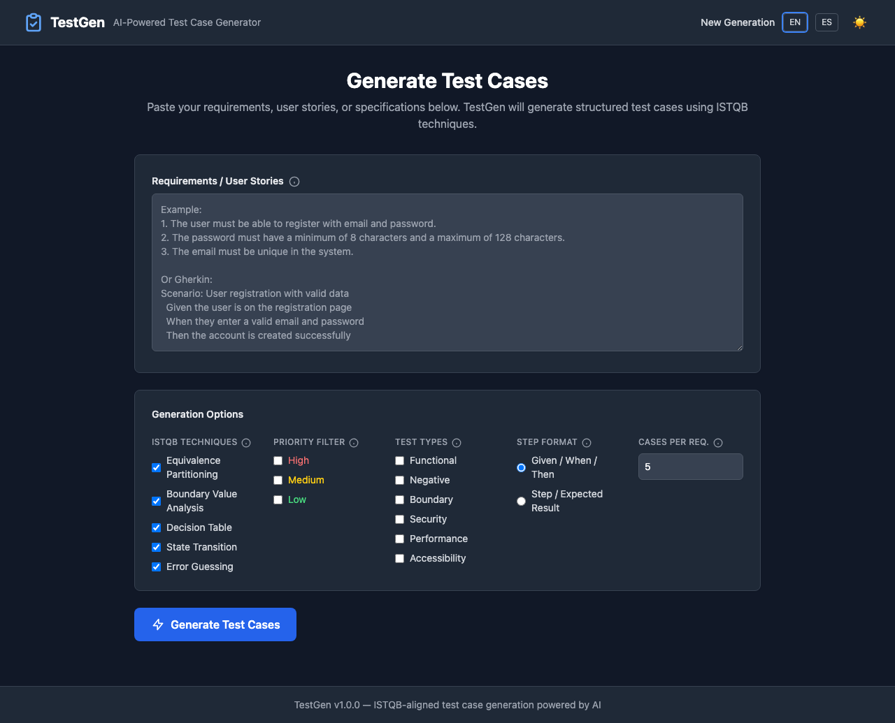
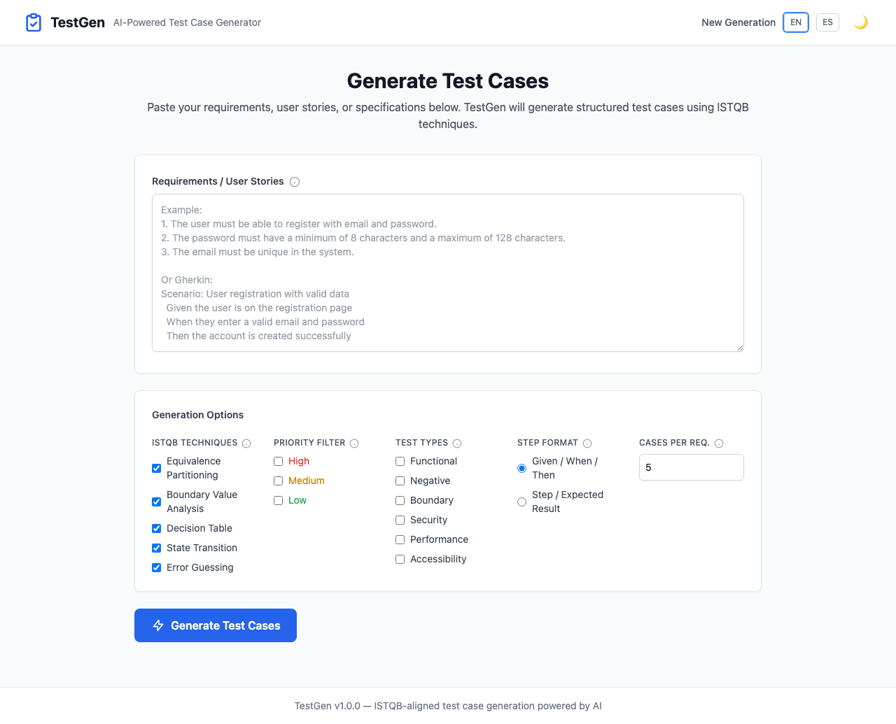
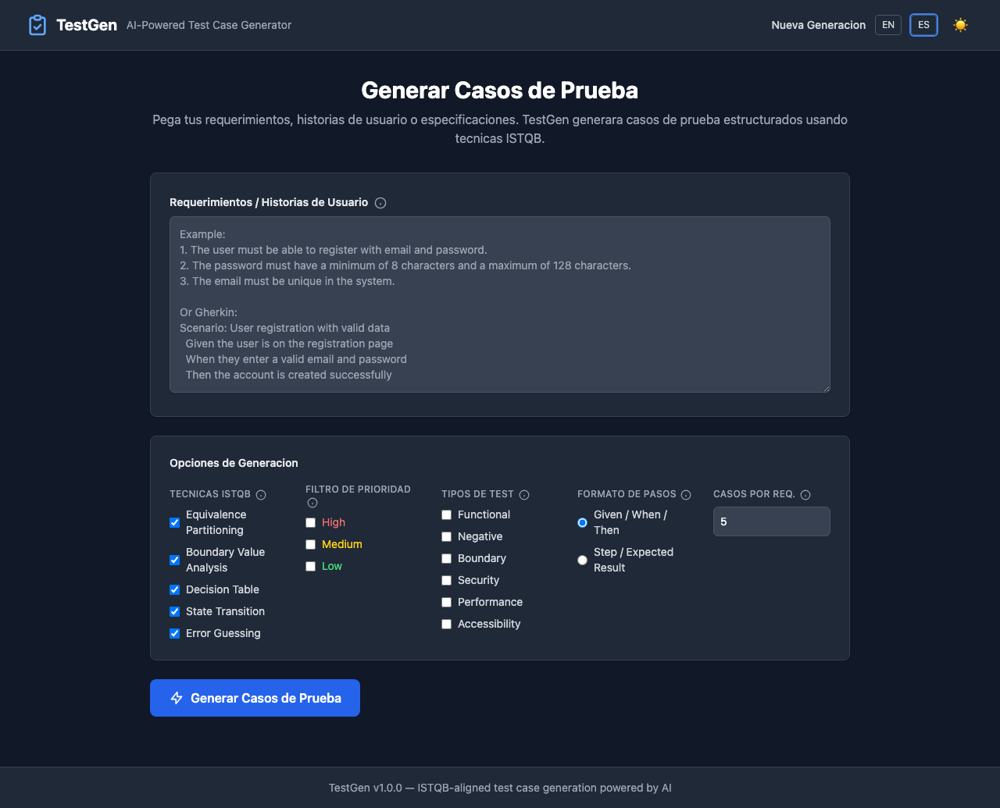

# TestGen

AI-powered test case generator that transforms requirements into structured, ISTQB-aligned test cases.

<p align="center">
  
</p>

<p align="center">
  
  
</p>

## Features

- **Multi-provider AI**: Supports Claude (Anthropic) and OpenAI-compatible models (GPT, Ollama, LM Studio, etc.)
- **ISTQB Techniques**: Equivalence Partitioning, Boundary Value Analysis, Decision Tables, State Transition, Error Guessing
- **Multiple Input Formats**: Plain text, numbered lists, bullet points, Gherkin, user stories, `.txt`, `.md`, `.pdf`
- **Step Format Options**: Given/When/Then or Step/Expected Result
- **Language-aware**: Generates test cases in the same language as the input requirements
- **Configurable Count**: Choose how many test cases per requirement (3-15)
- **Professional Exports**: Markdown, PDF, Excel (with auto-filters and styling), JSON
- **CLI + Web UI**: Typer CLI with Rich output and FastAPI web interface with HTMX
- **Dark / Light Mode**: Theme toggle with persistent preference
- **Bilingual UI**: English and Spanish interface
- **Full Traceability**: Every test case links back to its source requirement

## Quick Start

### Installation

```bash
pip install -e ".[dev]"
```

### Set API Key

```bash
cp .env.example .env
# Edit .env with your provider configuration
```

**Anthropic (default):**
```env
TESTGEN_ANTHROPIC_API_KEY=sk-ant-...
```

**OpenAI:**
```env
TESTGEN_LLM_PROVIDER=openai
TESTGEN_OPENAI_API_KEY=sk-...
TESTGEN_OPENAI_MODEL=gpt-4o
```

**Ollama (local):**
```env
TESTGEN_LLM_PROVIDER=openai
TESTGEN_OPENAI_API_KEY=ollama
TESTGEN_OPENAI_MODEL=llama3
TESTGEN_OPENAI_BASE_URL=http://localhost:11434/v1
```

### CLI Usage

```bash
# From text
testgen generate "The user must register with email and password. Password minimum 8 characters."

# From file
testgen generate --file requirements.md

# Export to specific format
testgen generate --file prd.md --format xlsx --output test-cases.xlsx
testgen generate --file prd.md --format pdf --output test-cases.pdf
testgen generate --file prd.md --format all --output-dir ./output/

# With options
testgen generate --file prd.md --techniques bva,ep,eg --priority high

# Step format: gwt (Given/When/Then) or ser (Step/Expected Result)
testgen generate --file prd.md --step-format ser

# Control test case count per requirement (3-15, default 5)
testgen generate --file prd.md --count 10
```

### Web UI

```bash
testgen serve --port 8000
# Open http://localhost:8000
```

### Docker

```bash
docker compose up
```

## Export Formats

### PDF
Generated from Markdown via xhtml2pdf (pure Python, no system dependencies):
- Summary statistics
- Detailed test cases with styled tables
- Traceability matrix
- Full Unicode support (Spanish, accents, special characters)

### Excel (XLSX)
Three sheets:
- **Summary**: overview statistics, distribution by priority/type/technique
- **Test Cases**: all details with auto-filters, column widths, conditional formatting
- **Traceability Matrix**: requirement-to-test-case mapping

### Markdown
Clean, readable format with:
- Summary table
- Overview table
- Detailed test cases with steps (GWT or Step/Expected)
- Traceability matrix

## Test Case Fields

| Field | Description |
|-------|-------------|
| ID | Unique identifier (TC-001, TC-002...) |
| Title | Descriptive test name |
| Preconditions | Required state before execution |
| Steps | Given/When/Then or Step/Expected Result format |
| Test Data | Concrete input values |
| Expected Result | Verifiable outcome |
| Priority | High / Medium / Low |
| Type | Functional, Negative, Boundary, Security, Performance, Accessibility |
| ISTQB Technique | EP, BVA, Decision Table, State Transition, Error Guessing |
| Traceability | Link to source requirement |

## ISTQB Techniques

| Technique | Description |
|-----------|-------------|
| Equivalence Partitioning | Divides inputs into valid/invalid classes |
| Boundary Value Analysis | Tests at exact boundary values (min-1, min, min+1, max-1, max, max+1) |
| Decision Table | Tests all condition combinations |
| State Transition | Tests valid and invalid state transitions |
| Error Guessing | Tests common defect patterns (null, XSS, SQL injection, unicode) |

## Development

```bash
# Install dev dependencies
pip install -e ".[dev]"

# Run tests
pytest tests/ -v

# Lint
ruff check src/ tests/
ruff format src/ tests/

# Type check
mypy src/testgen/
```

## Project Structure

```
src/testgen/
  cli.py                          # Typer + Rich CLI
  config.py                       # Settings, dataclasses, enums
  parser/
    text_parser.py                # Parse text into requirements
    file_parser.py                # Parse .txt, .md, .pdf
  generator/
    test_case_generator.py        # Main orchestrator
    llm_client.py                 # Multi-provider LLM client (Anthropic, OpenAI)
    techniques.py                 # ISTQB technique implementations
    prompts.py                    # LLM prompts (language-aware, step format)
  exporters/
    markdown_exporter.py          # Jinja2 Markdown export
    pdf_exporter.py               # MD→HTML→PDF export (xhtml2pdf)
    xlsx_exporter.py              # openpyxl Excel export
    json_exporter.py              # JSON export
  web/
    app.py                        # FastAPI + HTMX
    templates/                    # Jinja2 templates
tests/
  test_text_parser.py
  test_techniques.py
  test_generator.py
  test_exporters.py
  test_api.py
  fixtures/
```

## License

MIT
